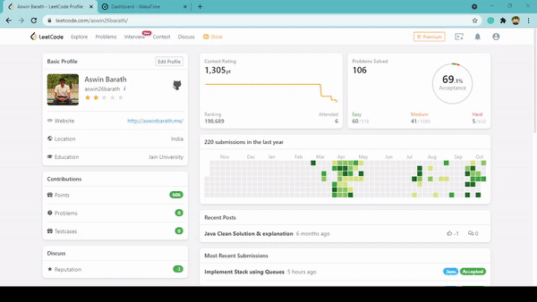
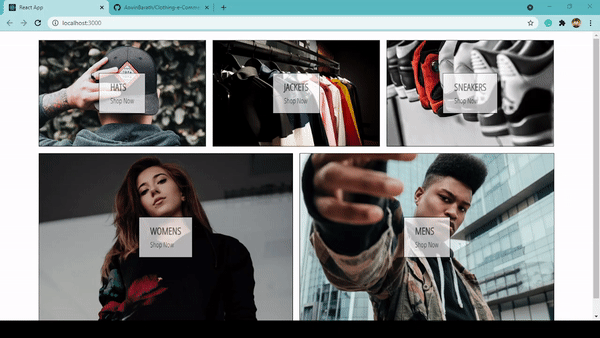
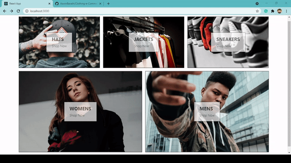

# 100-days-of-code-challenge

[100 Days of Code Challenge](https://www.100daysofcode.com/) is an initiative I am commiting to take, where I will be spending each day working on problem solving and personal projects to improve my skills and push my boundaries.

After two failed attempts, I'm coming back by publicly committing to the 100DaysOfCode Challenge starting today! 

I'm going to follow Two Main Rules:
1. Code a minimum of an hour every day for the next 100 days.
2. Tweet your progress every day with the #100DaysOfCode hashtag

My Exceptions:
- If I break the streak, I will make sure that I won't break it the next day
- My Community work, and few emergencies demands to take a day off

[#100DaysOfCode](https://100DaysOfCode.com) 

## Useful Links

- For Daily updates, follow me on:

    

    

    

 
 
 

---

## Goals

- [Learn Software Development with Java](#learn-software-development-with-java)
- [Learn Advanced Full-stack Development](#learn-advanced-full-stack-development)
- [Solve problems on Data Structures and Algorithms](#solve-problems-on-data-structures-and-algorithms)
- [Solve Python Challenges](#solve-python-challenges)
- [Build JU Query platform for university students](#build-ju-query-platform-for-university-students)
- [Build Web Developement projects](#build-web-developement-projects)
- [Build Python projects](#build-python-projects)
- [Build IoT Projects](#build-iot-projects)
- [Build Community Projects](#build-community-projects)

---

### Learn Software Development with Java 

- [x] Java Core Concepts
	- [x] Object Oriented Programming in Java - [Day 8-14](#day-8-14)
	- [x] Collections Framework - [Day 25-30](#day-25-30)
	- [x] Generics - [Day 25-30](#day-25-30)
	- [x] File Handling - [Day 25-30](#day-25-30)
	- [x] Exception Handling - [Day 25-30](#day-25-30)
	- [x] Concurrency and Multi-Threading - [Day 25-30](#day-25-30)
	- [x] JDBC - [Day 31](#day-31)
	- [x] Lambda Expressions and Stream API (Functional Programming) - [Day 32](#day-32), [Day 35](#day-35), [Day 36](#day-36)
- [ ] Solve Hackerrank Challenges in Java - [Day 15](#day-15)
- [ ] Object-Oriented Design - [Day 38](#day-38), [Day 70](#day-70)

---

### Solve problems on Data Structures and Algorithms

- [ ] Data Structures
	- [ ] Arrays - [Day 1](#day-1), [Day 2](#day-2), [Day 3](#day-3), [Day 21-24](#day-21-24), [Day 50](#day-50), [Day 64](#day-64)
	- [ ] Strings - [Day 21-24](#day-21-24), [Day 65](#day-65)
	- [ ] HashMaps - [Day 4](#day-4), [Day 8-14](#day-8-14), [Day 15](#day-15), [Day 21-24](#day-21-24), [Day 50](#day-50), [Day 64](#day-64)
	- [ ] Stacks - [Day 8-14](#day-8-14), [Day 60](#day-60), [Day 68](#day-68)
	- [ ] Queues - [Day 68](#day-68)
	- [ ] Linked Lists - [Day 21-24](#day-21-24), [Day 55](#day-55), [Day 56](#day-56), [Day 57](#day-57)
	- [ ] Trees - [Day 32](#day-32), [Day 37](#day-37)
	- [ ] Graphs - [Day 66](#day-66)
	- [ ] Heaps
	- [ ] Tries

- [ ] Algorithms
	- [x] Sorting
		- [x] Insertion Sort
		- [x] Selection Sort
		- [x] Bubble Sort
		- [x] Count Sort
		- [x] Merge Sort
		- [x] Quick Sort
	- [x] Searching
		- [x] Linear Search
		- [x] Binary Search - [Day 45](#day-45), [Day 47](#day-47), [Day 48](#day-48), [Day 50](#day-50), [Day 52](#day-52), [Day 62](#day-62)
		- [ ] BFS
		- [ ] DFS
	- [ ] Recursion - [Day 39](#day-39)
	- [ ] Backtracking
	- [ ] Dynamic Programming - [Day 53](#day-53), [Day 54](#day-54)
	- [ ] Two pointers - [Day 64](#day-64)
	- [ ] Greedy - [Day 64](#day-64), [Day 65](#day-65)
	- [ ] Bit Manipulation
	- [ ] Mathematical problems

---

### Learn Advanced Full-stack Development 
- [ ] JavaScript - [Day 8-14](#day-8-14), [Day 16-17](#day-16-17), [Day 18-20](#day-18-20), [Day 42](#day-42)
- [ ] ReactJS & ReduxJS - [Day 46](#day-46), [Day 60](#day-60), [Day 61](#day-61), [Day 67](#day-67), [Day 69](#day-69), [Day 70](#day-70)
- [ ] Firebase, - [Day 33](#day-33), [Day 34](#day-34)
- [ ] NodeJS, - [Day 49](#day-49)
- [ ] MongoDB

---

### Build JU Query platform for university students
- [ ] JU Query Features - [Day 43](#day-43), [Day 44](#day-44)
	- [ ] Add Authentication components
		- [x] Google OAuth
		- [x] Facebook OAuth - [Day 43](#day-43)
	- [ ] Homepage components
		- [x] Add Query component
		- [x] Answer Query component
		- [x] Show Answer component
	- [ ] Topic-specific components
	- [ ] User Profile components
	- [ ] Create Event specific components
	- [ ] Create User and Admin Roles
	- [ ] Add ML recommendation engine component
	- [ ] Create Admin Dashboard

---

### Build Web Developement projects
- [ ] Build Vanilla JavaScript Projects - [Day 40](#day-40), [Day 41](#day-41), [Day 47](#day-47), [Day 58](#day-58)
	- [x] Event Timeline Page - [Day 59](#day-59)
	- [x] Joke Teller - [Day 63](#day-63)
- [ ] Build ReactJS Web Apps
	- [x] Build a Portfolio Website - [Day 7](#day-7)
	- [ ] Build a LinkedIn Clone - [Day 46](#day-46)
	- [x] Build a Tesle Landing Page Clone - [Day 60](#day-60), [Day 61](#day-61), [Day 67](#day-67)
- [ ] Build NodeJS Microservices
	- [x] Login Microservice - [Day 51](#day-51)
	- [x] Event Timeline Page - [Day 59](#day-59)
	- [x] Real-time Twitter Streaming App - [Day 67](#day-67)
- [ ] Build Full-stack Apps
	- [x] SQL Injection - [Day 51](#day-51)
	- [ ] Clothing e-commerce application - [Day 69](#day-69), [Day 70](#day-70)
- [ ] Build React Native Apps
- [ ] Build Electron Apps
- [ ] Build Chrome Extensions

---

### Solve Python Challenges 
- [Day 5](#day-5), [Day 58](#day-58)

---

### Build Python projects

- [ ] Build Web Scrappers - [Day 6](#day-6)
- [ ] Build Python Scripts
- [ ] Build Automation Scripts and Tests
- [ ] Build Flask apps
- [ ] Build Basic ML Models
- [ ] Build Data Visualizations

---

### Build IoT Projects

- [x] Eco Monitor 
	- [x] Light Intensity Sensor project - [Day 8-14](#day-8-14)
	- [x] Eco Monitor - Visualizations of Sensor data project - [Day 8-14](#day-8-14)

---

### Build Community Projects
- [x] Event Timeline Page - [Day 59](#day-59)

---

## Day 1

- Solved 6 frequently asked Interview Problems on Array Data Structure:
  - Next Permutation
  - Pascal's Triangle II
  - Pascal's Triangle
  - Set Matrix Zeroes
  - Merge Intervals
  - Maximum Subarray

My Leetcode profile: [aswin26barath](https://leetcode.com/aswin26barath/)

## Day 2

- Solved 8 Problems on Array Data Structure at Leetcode and GFG:
  - Count Inversions
  - Buy and Sell stocks
  - Rotate Image
  - Search in 2D Matrix
  - Search in 2D Matrix - II
  - Determine Whether Matrix Can Be Obtained By Rotation
  - Majority element - I
  - Majority element - II

My Leetcode profile: [aswin26barath](https://leetcode.com/aswin26barath/)

## Day 3

- Solved 2 Problems on Array Data Structure at Leetcode:
  - [Reverse Pairs](https://leetcode.com/problems/reverse-pairs)
  - Most frequently asked Google SDE problem: [Unique Paths](https://leetcode.com/problems/unique-paths)

My Leetcode profile: [aswin26barath](https://leetcode.com/aswin26barath/)

## Day 4

- Revised Hashmaps and Generics concepts in Java
- Solved Two Sum problem using Hashmaps at Leetcode

My Leetcode profile: [aswin26barath](https://leetcode.com/aswin26barath/)

## Day 5

- Solved python challenges based on Object oriented programming

Python Challenge: [Challenge - 1](https://github.com/AswinBarath/Python-challenges#challenge-1)

## Day 6

- Built an IMDb web scrapper to generate the data of top 5 IMDb rated Movies and top 10 IMDb rated directors using Beautiful soup

Project Repository: [IMDb web scrapper](https://github.com/AswinBarath/IMDb-web-scrapper)

## Day 7

- Built my personal portfolio website -> https://aswinbarath.me/
- Deployed on Netlify hosting platform
- And set up a custom domain using namecheap service

## Day 8-14

- Started off with the week with vaccination 💉💪
- Solved SDE problems from GFG ✍
- Built an IoT project "Eco Monitor" - Light Intensity Sensor project🍀
- Performed data analystics using visualization to display sensor data 📈📊📉
- Solved Regular expression challenges in JavaScript from Hackerrank 🧾
- Built a Stack Data Structure using Java 📚
- Learnt more about objects, methods, dependencies 🕵️‍♀️
- Learnt basics of Spring framework (Java) 🍃

## Day 15

- Solved a SDE Hashing problem
- Brushed up Java skills with 30 Days of Code Hackerrank challenge

## Day 16-17

- Completed the JavaScript challenges from 10 Days of JS

## Day 18-20

Disentangled JavaScript Algorithms and Data Structures course from freeCodeCamp for the past three days:

- Solved more challenges on Regular expressions using JavaScript
- Completed JavaScript debugging challenges

Check out the JavaScript tutorials on Regular expressions to learn from basics to advanced regex statements by solving real-world challenges:

https://www.freecodecamp.org/learn/javascript-algorithms-and-data-structures/#regular-expressions

## Day 21-24

After solving various problems on Arrays, Strings and Hashmaps:

Pulled off a deep dive in Linked list data structure and learnt more about:

- What is a Linked list?
- Need for Linked list
- Arrays VS Linked list
- Types of Linked list
- Linked list operations
- Types of problems

Also I have solved few problems based on Linked list at Leetcode and GFG

- Reverse a Linked list
- Middle of a Linked list
- Even nodes after odd in Linked list

[Linked lists GitHub Repository](https://github.com/AswinBarath/Linked-lists)

## Day 25

- Brainstormed new ideas for JU Query project
- Took part in Phase 0 Project discussion
- Spun up the Repo for JU Query and provided neat documentation with Markdown language

## Day 26

- Revised the problem solving concepts of Arrays, Sorting, Recursion
- Learnt about basic problem solving using Binary Search

## Day 27

- Learnt more about problem solving techniques for Linked lists

## Day 28

- Constructed a project - Stock Analysis using Java that employs the following ideas:
	- File Handling
	- Generics
	- Collections Framework
	- Exception Handling
	- Try with Resources and AutoClosable Interface

## Day 29

- Practiced 3 different ways to start a thread in Java
- Learnt the concepts of Thread safety and Synchronization
- Practiced thread safety and synchronized blocks in Java
- Used concurrent collections for implementing thread safe Java programs

## Day 30

- Revised the concepts of Collections Framework
- Started learning about Producer Consumer Pattern
- Deciphered challenges in Hackerrank on Exception Handling using Java

## Day 31

- Executed a concurrent producer-consumer pattern using Java
- Operated with ArrayBlockingQueue collection
- Obtained knowledge on Thread pools
- Engaged Executor Framework to perform tasks using spawned thread pools

- Overview on Java Database Connectivity (JDBC)
- Installed MySQL for Java
- Connected a database using JDBC

## Day 32

- Grasped the concepts of Lambda expressions in Java
- Got the hang of the Functional programming paradigm implemented in Java 8
- Exercised converting methods into lambda expressions
- Designed custom Functional interfaces to operate with lambdas
- Pulled off a swift dive in Tree data structure and learnt more about:
    - Introduction and terminologies in a Tree
    - Types of Binary Trees
    - Types of Tree Traversals
    - Representation of Binary Tree in Java

[Trees Repo](https://github.com/AswinBarath/Trees)

## Day 33

- Refactored React hooks for JU Query project
- Uncovered more about the Firebase platform

Learn more about firebase from my blog posts:
- [What is Firebase?](https://aswinbarath.github.io/What-is-Firebase/)
- [Core Firebase Services](https://aswinbarath.github.io/Core-Firebase-services/)
- [Accessing Firebase Services](https://aswinbarath.github.io/Accessing-Firebase-services/)

## Day 34

- Deep dive into Firebase Firestore service
- Built a real-time dynamic chat application using firebase
- Deployed onto production using firebase hosting
- Fixed a production bug in the public directory

- Built a Image sharing application using firebase
- Deployed onto production using firebase hosting

## Day 35

- Practiced more on Lambda expressions using Java
- Gained more knowledge about Built-in Functional Interfaces in Java
- Learnt about default implementation in Functional Interfaces, a new feature from Java 8 
(This new feature was introduced to support new functional programming abilities from Java 8)

## Day 36

- Practised Lambda Expressions with Streams
- Completed the Practical Java Development Course, this is what I learnt:
	- The Collections Framework
	- Generics
	- Concurrency and Multithreading in Java
	- Java Database Connectivity (JDBC)
	- Lambda Expressions 
	- The Stream API

## Day 37

- Solved Tree traversals: Inorder, Preorder, Postorder

## Day 38

- Getting started with Object-Oriented Design (OOD) and Low-level Design (LLD).
- Revisited Objects, Methods and dependencies.
- Learnt more about Dependency Association, Composition Association and Aggregation Association through Java coding examples.

## Day 39

- Assessed my recursion skills in Java @HackerRank

	- Solved: Recursive Digit Sum
	- Solved: Fibonacci Numbers

- Can you complete the challenge? 
	- https://www.hackerrank.com/interview/interview-preparation-kit/recursion-backtracking/challenges

## Day 40

- Back to basics by refactoring a project repository: Book Information
- Resolved 4 issues from the project which include code refactoring, README update, and icon
- Reviewed my pull requests and merged them into the master branch
- Updated the entire codebase with bootstrap design inputs
- Complete directory restructure
- Followed naming conventions and best practices
- Well documented README
- Project: https://github.com/AswinBarath/Book-Information
- Here's the git history:

- Checkout the project demo over here: 

## Day 41

- Back to basics by refactoring the project repositories: Book Information 2.0, Robot Friend and Image portfolio
- Resolved 14 issues from the projects which include code refactoring, README update, and demo
- Reviewed my pull requests and merged them into the main branch
- Updated the entire codebase with bootstrap design inputs
- Complete directory restructure
- Followed naming conventions and best practices
- Well documented README
- Here are the project links
	- https://github.com/AswinBarath/Book-Information-2.0
	- https://github.com/AswinBarath/robot-friend
	- https://github.com/AswinBarath/Image-portfolio
- Checkout the project demos over here: 

## Day 42

- Solved JavaScript Strings and Arrays exercises from Front-end masters:

	- [Exercise tweet 1](https://twitter.com/AswinBarath2/status/1435647332813393928?s=20)
	- [Exercise tweet 2](https://twitter.com/AswinBarath2/status/1435657732607004673?s=20)

## Day 43

- Added Facebook OAuth feature to JU Query project
- Fixed bugs and improved web-app performance
- Refactored the React functional components

## Day 44

- Fixed production bugs
- Improved the design
- Refactored the React components
- gzipped the app for optimized production and deployed the bug fixes

## Day 45

- Learnt more about Binary Search and its importance
- Gained new knowledge on optimization of Binary Search:
	- Improvement in finding middle element
	- Order-agnostic Binary Search
- Repository:
	- https://git.io/JuSnw

## Day 46

- Learning more about Functional Components in React
- Started project-based learning through building LinkedIn clone:
	- Set up and built the header components
	- Worked on Sidebar components

## Day 47

- Solved 4 problems on Binary Search
	- Repo: https://git.io/JuSnw

- Refactored, Documented and Optimized 3 front-end projects
	- Repo: https://git.io/JuSnD

## Day 48

- Solve 3 problems on Binary Search - Easy, Medium, Hard
	- Peak index in Mountain array
	- Find Peak Element
	- Find in Mountain array

- Repo: https://git.io/JuSnw

## Day 49

- Solved 10+ API based challenges using NodeJS and ExpressJS from freeCodeCamp

	- GitHub Repository: https://git.io/JuAl6
	- Always On Repl: https://replit.com/@ashwin26/nodejs-expressjs-scripts?v=1
	- Live link: https://nodejs-expressjs-scripts.ashwin26.repl.co/

## Day 50

- Solved 3 problems on the topics Arrays, Hashing and Binary Search at Leetcode
	
	- Maximum Subarray
	- Contains Duplicate
	- Search in Rotated Sorted Array

## Day 51

- Worked on 2 projects:
	- Simplistic Login Microservice built with NodeJS & ExpressJS
		- [GitHub Repo](https://git.io/JzTxW)
		- [Live link](https://login-microservice-fcc.herokuapp.com)
		- Optimized the project
		- Documented the code and readme
	- SQL injection which demonstrates attacks using malicious SQL queries
		- [GitHub Repo](https://git.io/JzTN4)
		- [Live link](https://sql-injection-and-prevention.herokuapp.com)
		- Refactored the project
		- Updated documentation

## Day 52

- Solved 10 problems using 3 variations of Binary Search at LeetCode 

## Day 53

- Explored patterns in Dynamic Programming (DP) problems
- Solved the problems similar to Fibonacci problem using DP:
	- Climbing Stairs
	- House Robber
- Repository: [Dynamic-Programming](https://github.com/AswinBarath/Dynamic-Programming)

## Day 54

- Solved problems from 2 Dynamic Programming (DP) patterns:
	- Min Cost Climbing Stairs
	- Partition Equal Subset Sum
- Repository: [Dynamic-Programming](https://github.com/AswinBarath/Dynamic-Programming)

## Day 55

- Solved problems on Linked lists based on 2 patterns:
	- Reverse the given Linked list
	- Remove Nth Node from the end of the list (Runner pattern - also known as Tortoise-Hare)
- Repository: [Linked-lists](https://git.io/Jz4T7)

## Day 56

- Solved 3 problems on Linked lists:
	- Delete a node in a linked list
	- Add two numbers I & II
- Refactored the Java Packages, Formatted the code, and fixed all of the bugs
- Generated self-sustaining templates for problems
- Repository: [Linked-lists](https://git.io/Jz4T7)

## Day 57

- Solved 3 problems on Linked Lists:
	- Remove Linked List Elements
	- Merge Two Sorted Lists
	- Return Kth Node From End of List
- Added more packages and documentation
- Repository: [Linked-lists](https://git.io/Jz4T7)

## Day 58

- Updated the configuration in the JavaScript Repos:
	- authenticated-todo-app
	- nest-js-api
- Added more Python Challenges on various topics such as:
	- data structures, map, lambda,filter, zip, reduce, decorators, generators, file handling & exception handling
- [Python programming challenges](https://github.com/AswinBarath/Python-challenges)

## Day 59

- Built an Event timeline web app for Codecademy JU Chapter Community
- Deployed the web app on top of Repl it using NodeJS and ExpressJS
- [Event Timeline web app](https://event-timeline.ashwin26.repl.co/)
- [Join Codecademy JU Chapter](https://community.codecademy.com/jain-university-ju/)
- [GitHub Repository](https://github.com/AswinBarath/Event-Timeline)
- Web App Demo

## Day 60

- Implemented the Stack Data Structure in 4 ways:
	- Stack Implementation using Arrays
	- Generic Stack Implementation
	- Stack Implementation using Linked Lists
	- Stack in Collections Framework
- [Stacks Repository](https://github.com/AswinBarath/Stacks)
- Continued project-based learning through building Tesla clone:
	- Set up and built the homepage component
	- Worked on Section components for reusability
- [Repository](https://github.com/AswinBarath/tesla-clone)

## Day 61

- Added Header component in the Tesla React Clone App
- Used Hamburger Menu from Material UI
- Applied media-queries for Dynamic display.
- [Repository](https://github.com/AswinBarath/tesla-clone)

## Day 62

- Solved a couple of problems on Binary Search
- Structured the problems into 3 templates of Binary Search
- Documented a list of Easy, Medium and Hard problems from the same topic
- Repository: https://git.io/JuSnw

## Day 63

- Built a Joke Teller web app using
	- JokeAPI (RESTful)
	- Text-to-Speech API (VoiceRSS)
- [Repository](https://git.io/JgyzX)
- [Deployed Link](https://aswinbarath.github.io/Joke-teller/)

- Updated Arrays data structure repository
- [Repository](https://git.io/Jgyg0)

## Day 64

- Solved two problems using Java in Brute force and Optimal ways
	- Two Sum `HashMaps`, `Two Pointers`, `Arrays`
	- Container With Most Water `Two pointer`, `Greedy`, `Arrays`
- Solved a problem from LeetCode Contest
	- Convert 1D Array Into 2D Array `Arrays`, `Matrix`

## Day 65

- Solved two problems from LeetCode Contest:
	- Find Missing Observations `Greedy`, `Strings`
	- Minimum Moves to Convert String `Strings`

- Taught DOM Manipulation as part of JavaScript Roadmap event at Codecademy JU chapter

## Day 66

- Revised the Theoretical concepts of Graph Data Structure
- Updated GitHub Profile README with a new look

- [Graphs Repository](https://github.com/AswinBarath/Graphs)
- [GitHub Profile README](https://github.com/AswinBarath/AswinBarath)

## Day 67

- Completed the development of Tesla's landing page in ReactJS
- [Tesla Landing Page Clone App](https://github.com/AswinBarath/tesla-clone)

- Built a Real-time Twitter Streaming App with NodeJS, SocketIO and Twitter APIs

	

 

- Transformed my GitHub Profile README to a newer and better look

	

- [GitHub Profile README](https://github.com/AswinBarath/AswinBarath)

 

## Day 68

- Solved two problems based on Stacks:
	- Valid Parenthesis
	- Next Greater Element
- Implemented Queue using Array
- Implemented Stack using Queue
- Implemented Queue using Stack
- [Stacks Repo](https://github.com/AswinBarath/Stacks)
- [Queues Repo](https://github.com/AswinBarath/Queues)

	

## Day 69

- Started to build a massive e-commerce react application which is similar to Shopify
- Here's my project pipeline for the day:
	- Project initialization using Create React App
	- Adding NodeJS SASS package for styling
	- Broken homepage into components & applied SASS animations
- [Clothing e-commerce React application repository](https://github.com/AswinBarath/Clothing-e-Commerce)

	

## Day 70

- Updated menu-items component to automate the page routing to specific URLs based on the passed props  using React Router
- [Clothing e-commerce React application repository](https://github.com/AswinBarath/Clothing-e-Commerce)
- Added my work on Object Oriented Design based on project based learning approach
- [https://github.com/AswinBarath/Object-Oriented-Design](https://github.com/AswinBarath/Object-Oriented-Design)

	

## Day 71

- Taught Git and GitHub at Codecademy JU Chapter
- Recording: https://lnkd.in/eAn6QAYt
- Wrap Up Page: https://lnkd.in/eUa4haKp
- [Git and GitHub Basics](https://github.com/AswinBarath/Git-and-GitHub-Basics)

## Day 72

- Taught ECMAScript Features from JavaScript at Codecademy JU Chapter
- Wrap Up Page: [https://community.codecademy.com/events/details/codecademy-jain-university-ju-presents-javascript-roadmap-iii/](https://community.codecademy.com/events/details/codecademy-jain-university-ju-presents-javascript-roadmap-iii/)
- [JS Roadmap ECMAScript](https://github.com/AswinBarath/javascript-roadmap-ecmascript)

## Day 73

- Solved two problems from Linked Lists
	- Intersection of Two Linked Lists
	- Cycle Detection in a Linked List
- Restructured the developer environment at JU Query project
- Added React-router-DOM package with basic routing abilities for JU Query Web App
- [JU Query Repo](https://github.com/AswinBarath/ju-query)

## Day 74

- Solved 3 problems using Linked Lists
	- Reverse Nodes in k-Group
	- Swap Nodes in Pairs
	- Swapping Nodes in a Linked List

## Day 75

- Solved the Linked List Palindrome checker problem at LeetCode

## Day 76

- Built different pages and components for JU Query Project85
- Experimented pages with React Router and learning more about it

---

## Contributors

- T Aswin Barath <aswin2001barath@gmail.com>

---

## License & copyright

(c) T Aswin Barath

Licensed under the [MIT License](LICENSE).
