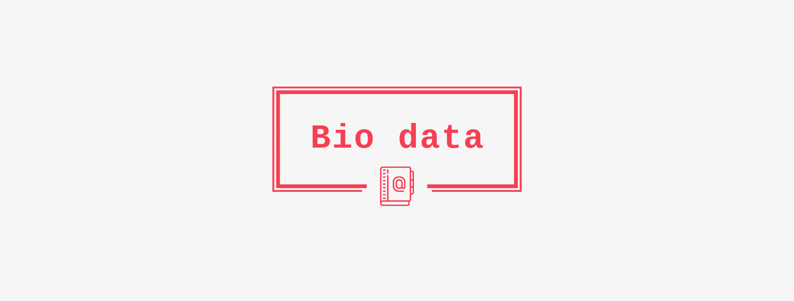
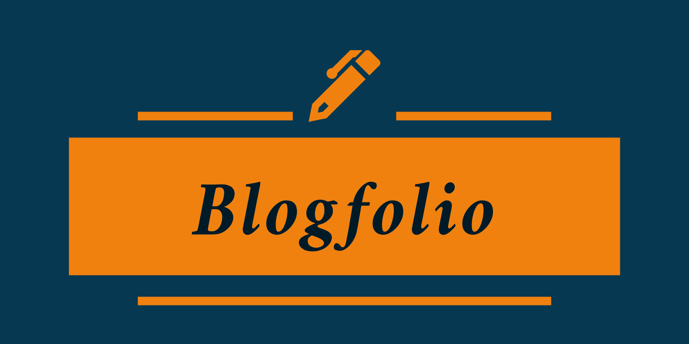
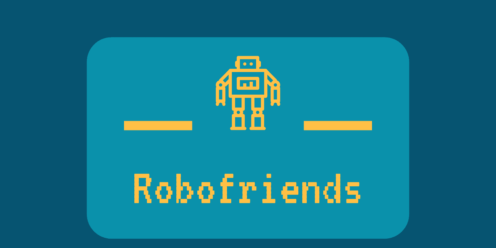

# 100-days-of-code-challenge

[100 Days of Code Challenge](https://www.100daysofcode.com/) is an initiative I am commiting to take, where I will be spending each day working on a personal project which mainly focuses on HTML, CSS and JS to improve my skills and push my boundaries.

## Useful Links

- For Daily updates, follow me on:

    
    

    

 
 
 

## Day 1

I spent a good couple of hours setting up and configuring Boostrap on the form layout as the foundation for the first project. Worked a little on project logo and icon.

Repo: [bio-data](https://github.com/AswinBarath/bio-data)

   
   
   
   

## Day 2

Spent time on Blogfolio - my personal blogging website. I created a form builder using mailchimp and deployed an automated newsletter campaign. Added meta tags for displaying thumbnails and description when sharing my blogfolio site link. Also worked on project logo and favicon. And I Finalized the blogfolio project by adding GPL-3.0 License.

Repo: [blogfolio](https://github.com/AswinBarath/aswinbarath.github.io)

   
   
   
   

## Day 3

Spent a couple of hours learning React.js library. And started building a fun little React app - Robofriends. Also set up npm packages like tachyons for adding simple CSS styles. A few tweaks and design inputs should be enough to finish off the app.

   
   
   
   

## Day 4

Built out a fully-functional React app - Robofriends. Worked on building responsive Components using React library and set up ErrorBoundary component to catch errors and display neat error message. Finally deployed the app into production on GitHub pages.

Repo: [robofriends](https://github.com/AswinBarath/robofriends)

Project: [robofriends app](https://aswinbarath.github.io/robofriends/)

   
   
   
   

---

## Contributors

- T Aswin Barath <aswin2001barath@gmail.com>

---

## License & copyright

(c) T Aswin Barath

Licensed under the [MIT License](LICENSE).